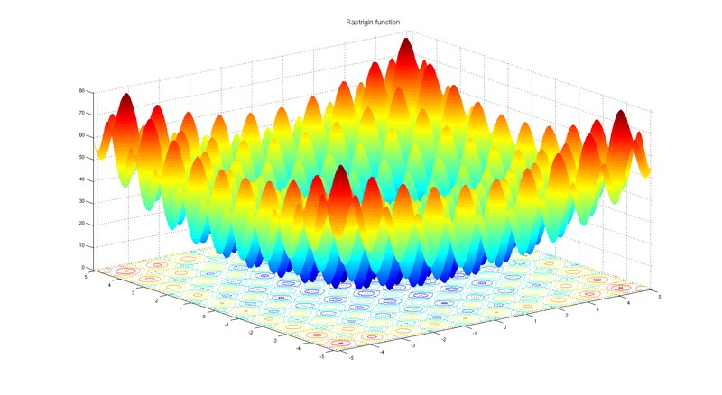
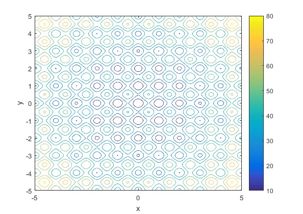

# Rastrigin Function

## Foundations

In mathematical optimization, the Rastrigin function is a non-convex function used as a performance test problem for optimization algorithms. It is a typical example of non-linear multimodal function.

Finding the minimum of this function is a fairly difficult problem due to its large search space and its large number of local minima.

On an n-dimensional domain it is defined by
=An&plus;sum_%7Bi=1%7D%5E%7Bn%7D%5Bx_i%5E2-Acos(2pi&space;x_i)%5D "Equation of Rastrigin function")

- beispielaufzählung
- neues beispiel

where A=10 and 

It has a global minimum at x=0 where f(x)=0.

## Plot

